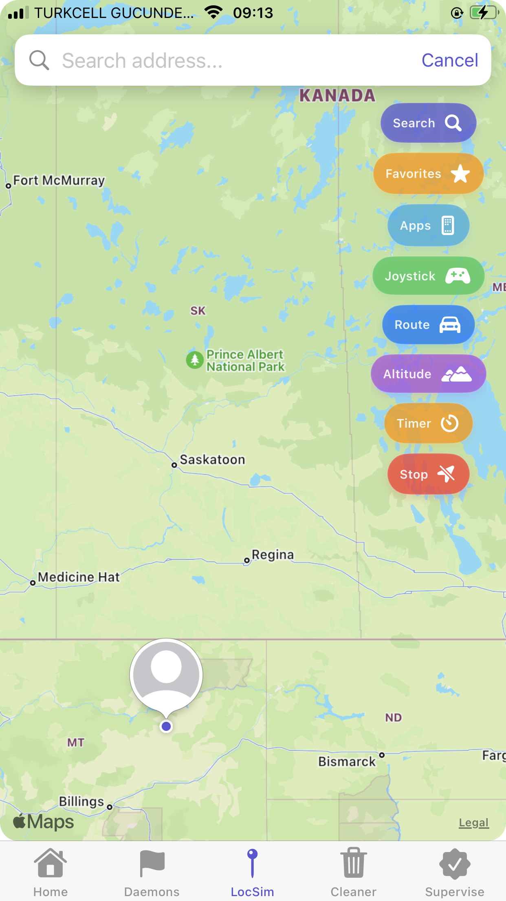
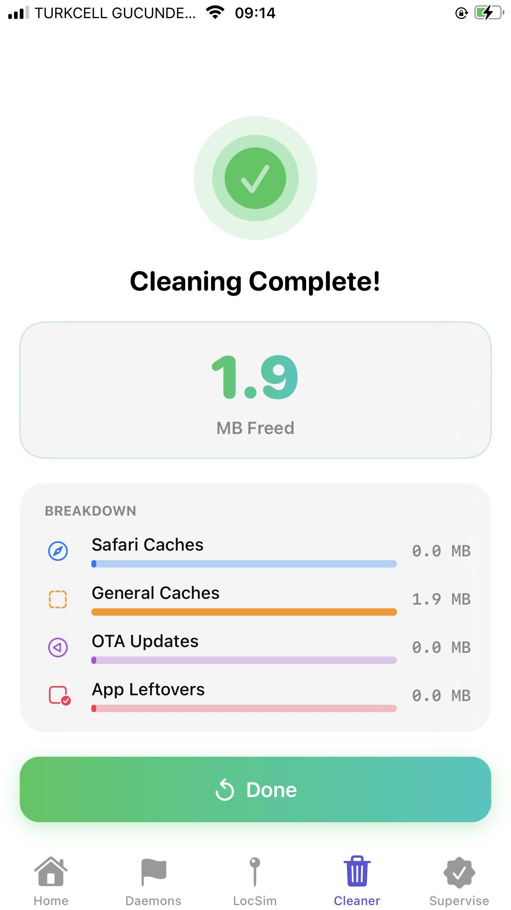
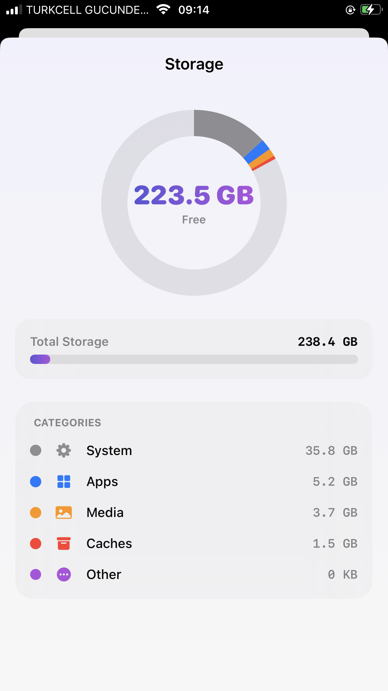

<div align="center">


# Andromeda
### The Ultimate iOS Utility — by son3ra1n

[](https://github.com/Sonerbt/Andromeda)
[](https://github.com/opa334/TrollStore)
[](LICENSE)
[](https://github.com/Sonerbt/Andromeda/releases)

**Andromeda** is a powerful, modern iOS utility app featuring location simulation, system cleaning, daemon management, and much more — all wrapped in a stunning glassmorphism UI.

</div>

---

## ✨ Features

### 🌍 LocSim Pro — Advanced Location Simulator
- **🕹️ Real-time Joystick** — Move your GPS instantly with 4 speed modes (Walk, Run, Bike, Car)
- **🛣️ Route Simulation** — Follow paths automatically with speed multipliers
- **📂 GPX Support** — Import your own route files for automated movement
- **📱 App Profiles** — Custom location presets per app (Tinder, PoGo, etc.)
- **🎛️ Quick Menu** — New sidebar for instant tool access
- **⭐ Favorites v2** — One-tap location saving
- **⏱️ Auto-Stop Timer** — Automatically turn off LocSim (15m to 2h)

### 🧹 Cleaner & Analyzer
- **📊 Storage Dashboard** — Beautiful interactive donut chart for storage breakdown
- **🧹 System Cleaner** — Clean junk, caches, and temp files with real-time progress
- **⚙️ Configurable Filters** — Minimum file size control and Safe Mode

### 🚩 Utilities
- **Daemons Manager** — Enable / Disable system daemons safely
- **Supervise** — Device oversight and supervision tools
- **ByeTime** — Disable Screen Time restrictions (iCloud supported)

---

## 🎥 Demo Video

<div align="center">
  <p>Click the image below to watch Andromeda's realistic route simulation in action:</p>

  [](https://github.com/Sonerbt/Andromeda/raw/main/Media/route_simulation.mov)

  *(Clicking will open the video in a new tab)*
</div>

---

## 📱 Screenshots

<div align="center">
  <h3>✨ New v2.5.2 Features</h3>
  <table style="border: none;">
    <tr>
      <td align="center"><b>Storage Analyzer</b><br/></td>
      <td align="center"><b>Cleaner (Result)</b><br/></td>
      <td align="center"><b>LocSim Pro</b><br/></td>
    </tr>
  </table>

  <h3>📱 App Interface</h3>
  <table style="border: none;">
    <tr>
      <td align="center"><b>Search</b><br/></td>
      <td align="center"><b>Route Selection</b><br/></td>
      <td align="center"><b>Route Details</b><br/></td>
      <td align="center"><b>Map View</b><br/></td>
    </tr>
  </table>
</div>

---

## 🚀 Installation

### Requirements
- **iOS 15.0 - 17.0** (TrollStore supported versions)
- [TrollStore](https://github.com/opa334/TrollStore) installed on your device

### Steps

1. Download the latest `Andromeda_v2.5.2.tipa` from the [**Releases**](https://github.com/Sonerbt/Andromeda/releases) page.
2. Open **TrollStore** on your iPhone.
3. Tap **+** and select the downloaded file.
4. Tap **Install**.
5. Launch **Andromeda** from your home screen. 🌌

---

## 🛠 Building from Source

```bash
# Clone the repository
git clone https://github.com/Sonerbt/Andromeda.git
cd Andromeda

# Open in Xcode
open Geranium.xcodeproj

# Build for your device (requires macOS + Xcode 15+)
# Set scheme to "Geranium" and target to a generic iOS device
```

---

## 📜 Acknowledgments

Andromeda was **inspired by and built upon** the excellent work of:

| Project | Author | Contribution |
|---------|--------|-------------|
| [Geranium](https://github.com/c22dev/Geranium) | [c22dev](https://github.com/c22dev) | Original project & core architecture |
| [Geranium](https://github.com/BomberFish/Geranium) | [BomberFish](https://github.com/BomberFish) | Daemon listing |

---

## 📄 License

This project is licensed under the **GNU General Public License v3.0** — see the [LICENSE](LICENSE) file for details.

---

<div align="center">

Made with ❤️ and 🌌 by **son3ra1n**

*"Reach for the stars."*

⭐ **Star this repo if you find it useful!**

</div>
